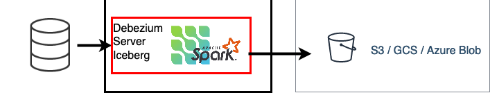

[](http://www.apache.org/licenses/LICENSE-2.0.html)


# Table of contents

* [Debezium Batch Consumers](#debezium-batch-consumers)
    * [`sparkbatch` Consumer](#sparkbatch-consumer)
* [Install from source](#install-from-source)

# Debezium Batch Consumers

This project adds spark consumer
to [Debezium Server](https://debezium.io/documentation/reference/operations/debezium-server.html). Using spark consumer
its possible to consume CDC events as mini batches



## `sparkbatch` Consumer

Consumes debezium events using spark

| Config                                              | Default              | Description                                                                         |
|-----------------------------------------------------|----------------------|-------------------------------------------------------------------------------------|
| `debezium.sink.sparkbatch.bucket-name`              | `s3a://My-S3-Bucket` | Destination bucket                                                              |
| `debezium.sink.sparkbatch.save-format`              | `parquet`            | Spark save format                                                                   |
| `debezium.sink.sparkbatch.save-mode`                | `append`             | Spark save mode                                                                     |
| `debezium.sink.sparkbatch.cast-deleted-field`       | `false`              | Cast deleted field to bolean type(by default it is string mode)                     |
| `debezium.sink.sparkbatch.<spark config>`           | ``                   | Any spark config passed to spark                                                    |
| `debezium.sink.batch.objectkey-partition`           | `false`              | Partition destination by year=yyy/month=mm/day=dd                                   |
| `debezium.sink.batch.objectkey-partition-time-zone` | `UTC`                | Timezone to use when generating partitions                                          |
| `debezium.sink.batch.objectkey-prefix`              | ``                   | Prefix to add each destination                                                      |
| `debezium.sink.batch.destination-regexp`            | ``                   | Regexp to modify destination                                                        |
| `debezium.sink.batch.destination-regexp-replace`    | ``                   | Regexp Replace part to modify destination                                           |
| `debezium.sink.batch.batch-size-wait`               | `NoBatchSizeWait`    | Batch size wait strategy to optimize data files and upload interval. explained below. |

### Mandatory config

#### Debezium Event format and schema

```properties
debezium.format.value=json
debezium.format.key=json
debezium.format.schemas.enable=true
```

#### Flattening Event Data

Batch consumer requires event flattening, please
see [debezium feature](https://debezium.io/documentation/reference/configuration/event-flattening.html#_configuration)

```properties
debezium.transforms=unwrap
debezium.transforms.unwrap.type=io.debezium.transforms.ExtractNewRecordState
debezium.transforms.unwrap.add.fields=op,table,lsn,source.ts_ms
debezium.transforms.unwrap.add.headers=db
debezium.transforms.unwrap.delete.handling.mode=rewrite
```

### Optimizing batch size (or commit interval)

Debezium extracts database events in real time and this could cause too frequent commits or too many small files
which is not optimal for batch processing especially when near realtime data feed is sufficient.
To avoid this problem following batch-size-wait classes are used.

Batch size wait adds delay between consumer calls to increase total number of events received per call and meanwhile
events are collected in memory.
This setting should be configured together with `debezium.source.max.queue.size` and `debezium.source.max.batch.size`
debezium properties

#### NoBatchSizeWait

This is default configuration, by default consumer will not use any wait. All the events are consumed immediately.

#### DynamicBatchSizeWait

**Deprecated**
This wait strategy dynamically adds wait to increase batch size. Wait duration is calculated based on number of
processed events in
last 3 batches. if last batch sizes are lower than `max.batch.size` Wait duration will increase and if last batch sizes
are bigger than 90% of `max.batch.size` Wait duration will decrease

This strategy optimizes batch size between 85%-90% of the `max.batch.size`, it does not guarantee consistent batch size.

example setup to receive ~2048 events per commit. maximum wait is set to 5 seconds

```properties
debezium.source.max.queue.size=16000
debezium.source.max.batch.size=2048
debezium.sink.batch.batch-size-wait=DynamicBatchSizeWait
debezium.sink.batch.batch-size-wait.max-wait-ms=5000
```

#### MaxBatchSizeWait

MaxBatchSizeWait uses debezium metrics to optimize batch size, this strategy is more precise compared to
DynamicBatchSizeWait.
MaxBatchSizeWait periodically reads streaming queue current size and waits until it reaches to `max.batch.size`.
Maximum wait and check intervals are controlled by `debezium.sink.batch.batch-size-wait.max-wait-ms`
, `debezium.sink.batch.batch-size-wait.wait-interval-ms` properties.

example setup to receive ~2048 events per commit. maximum wait is set to 30 seconds, streaming queue current size
checked every 5 seconds

```properties
debezium.sink.batch.batch-size-wait=MaxBatchSizeWait
debezium.sink.batch.metrics.snapshot-mbean=debezium.postgres:type=connector-metrics,context=snapshot,server=testc
debezium.sink.batch.metrics.streaming-mbean=debezium.postgres:type=connector-metrics,context=streaming,server=testc
debezium.source.connector.class=io.debezium.connector.postgresql.PostgresConnector
debezium.source.max.batch.size=2048;
debezium.source.max.queue.size=16000";
debezium.sink.batch.batch-size-wait.max-wait-ms=30000
debezium.sink.batch.batch-size-wait.wait-interval-ms=5000
```

## Configuring log levels

```properties
quarkus.log.level=INFO
# Change this to set Spark log level
quarkus.log.category."org.apache.spark".level=WARN
# hadoop, parquet
quarkus.log.category."org.apache.hadoop".level=WARN
quarkus.log.category."org.apache.parquet".level=WARN
# Ignore messages below warning level from Jetty, because it's a bit verbose
quarkus.log.category."org.eclipse.jetty".level=WARN
#
```

# Install from source

- Requirements:
    - JDK 11
    - Maven
- Clone from repo: `git clone https://github.com/memiiso/debezium-server-spark.git`
- From the root of the project:
    - Build and package debezium server: `mvn -Passembly -Dmaven.test.skip package`
    - After building, unzip your server
      distribution: `unzip debezium-server-spark-dist/target/debezium-server-spark-dist*.zip -d appdist`
    - cd into unzipped folder: `cd appdist`
    - Create `application.properties` file and config it: `nano conf/application.properties`, you can check the example
      configuration
      in [application.properties.example](debezium-server-spark-sinks/src/main/resources/conf/application.properties.example)
    - Run the server using provided script: `bash run.sh`
